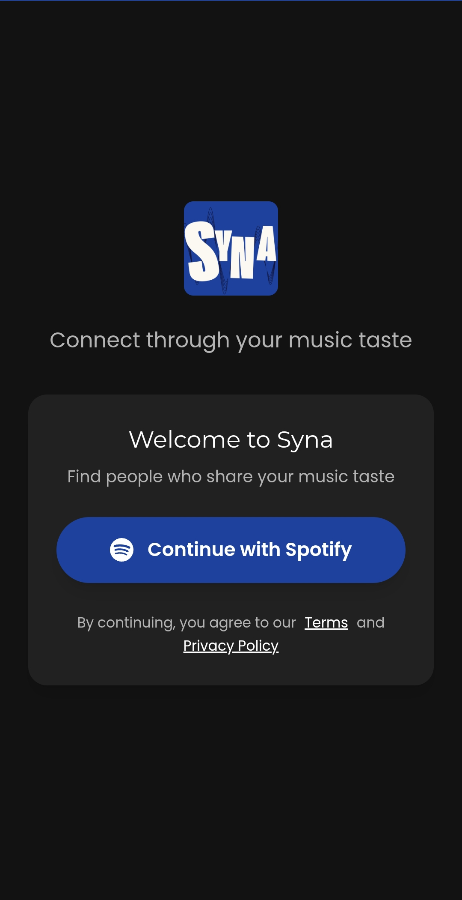
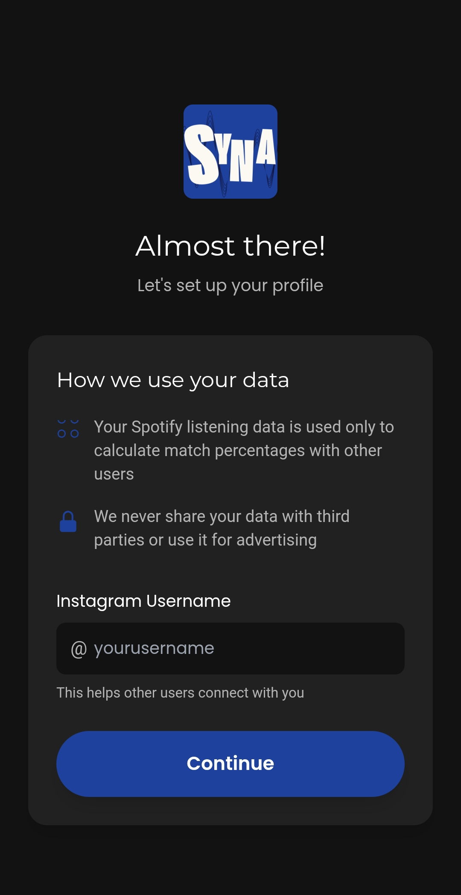
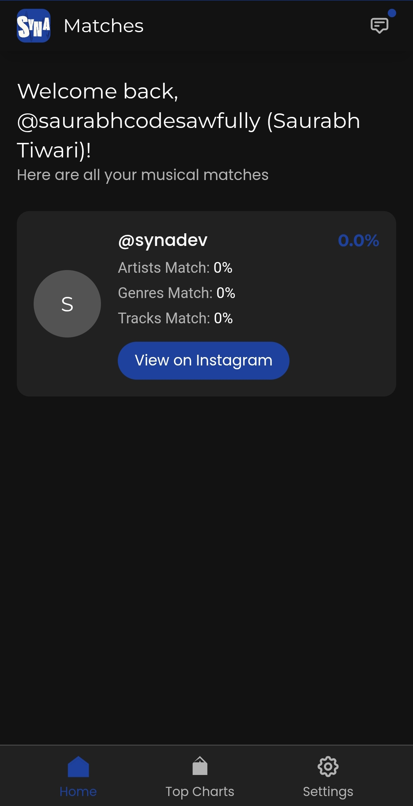
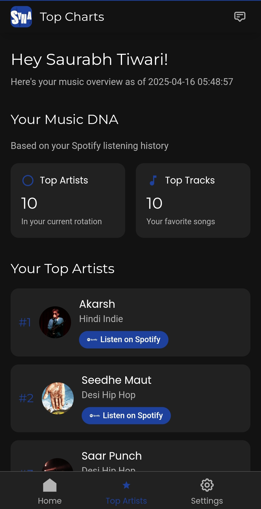
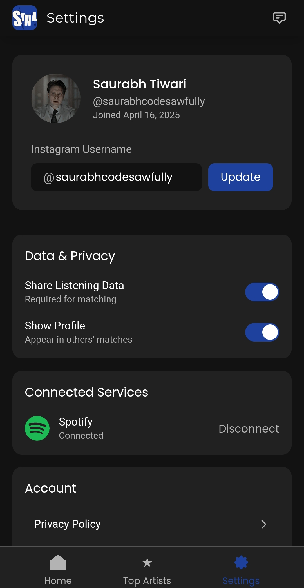
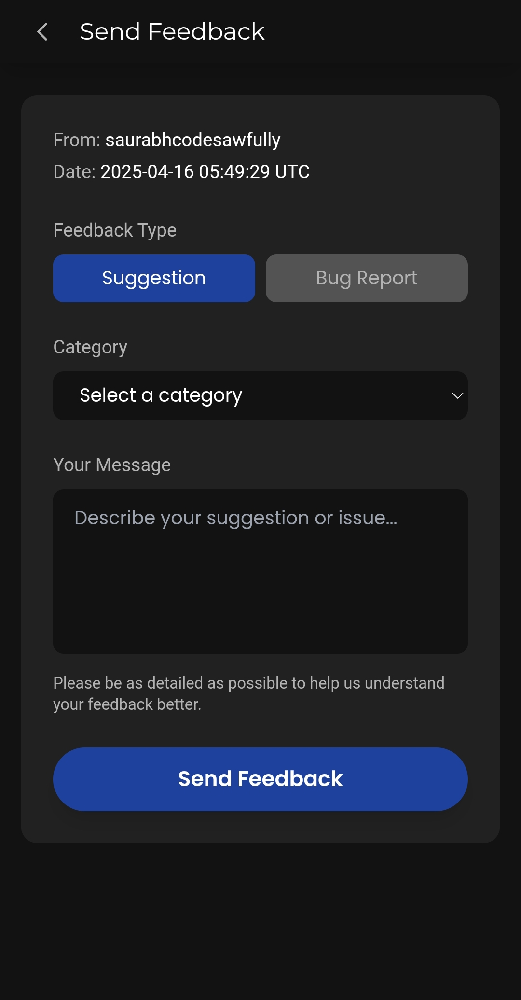

<p align="center">
  
</p>
<h1 align="center">Syna</h1>

<p align="center">
Syna is a social music web application where users can log in using their Spotify accounts and find their best matches based on shared music preferences. The app is designed to connect music enthusiasts and create a community centered around their love for music.
</p>

<p align="center">
  
  
  
  
  
</p>

## 🎵 Project Vision

<p><strong>Syna</strong> connects people through their love of music. By analyzing your Spotify listening habits, the app uses a sophisticated cosine similarity algorithm to match you with users who share your musical taste. Whether you're looking to discover new music, find friends with similar tastes, or simply explore your own listening patterns, Syna creates a space where music becomes the universal language that brings people together.</p>

---

## ✨ Live Website

Syna is live and available for anyone to use! Connect with others through your music taste today.

- **Website**: [Syna](https://syna.pythonanywhere.com/)
- **Hosting**: PythonAnywhere

> **Note**: We have submitted a request to Spotify on April 16, 2025, for a quota extension to support more users. Our application is currently in the first version, and we are actively working on improvements based on user feedback.

---

## ✨ User Experience

Syna offers a seamless user experience with a clean, modern interface powered by Tailwind CSS:

<p align="center">
  
  
  
</p>
<p align="center">
  
  
  
</p>

---

## 🌟 Features

- **Spotify Integration**: Securely log in with your Spotify account to share your music preferences
- **Smart Matching Algorithm**: Find your best matches using cosine similarity based on music preferences
- **Personalized User Profiles**: View detailed profiles showing top artists and tracks
- **Top Charts**: Explore your personal top tracks and artists based on your Spotify listening history
- **User Discovery**: Browse profiles of other users with similar music taste
- **Clean, Responsive UI**: Enjoy a beautiful interface built with Tailwind CSS that works on any device

---

## 🖥️ Technology Stack

- **Frontend**: HTML with Tailwind CSS for a responsive, modern user interface
- **Backend**: Flask to handle backend logic and API integration
- **Authentication**: Spotify OAuth 2.0 for secure user authentication
- **Database**: SQLite for efficient data storage and retrieval
- **Algorithm**: Cosine Similarity for intelligent user matching based on music preferences
- **Design**: Custom color palette and typography inspired by music platforms
- **Hosting**: Deployed on PythonAnywhere for reliable access

---

## 🔄 User Flow

<p align="center">
  
</p>

1. **Connect**: Log in with your Spotify account
2. **Analyze**: Our algorithm analyzes your music preferences
3. **Match**: Find users with similar music taste
4. **Explore**: Discover new music through your matches
5. **Connect**: Build relationships based on shared music interests

---

## 🎨 Design Guidelines

### **Fonts**
- **Primary Font**: [Montserrat](https://fonts.google.com/specimen/Montserrat) for headings and titles
- **Secondary Font**: [Poppins](https://fonts.google.com/specimen/Poppins) for body text and UI elements

### **Color Palette**

| **Color Name**   | **Hex Code** | **RGB Values**       | **Usage**                                   |
|-------------------|-------------|----------------------|---------------------------------------------|
| **Bluish Accent** | `#1d419d`   | `rgb(29, 65, 157)`   | Primary brand color: buttons, icons, highlights |
| **Dark Gray**     | `#212121`   | `rgb(33, 33, 33)`    | Backgrounds and dark UI elements            |
| **Black**         | `#121212`   | `rgb(18, 18, 18)`    | App background for dark theme               |
| **Medium Gray**   | `#535353`   | `rgb(83, 83, 83)`    | Secondary text or inactive elements         |
| **Light Gray**    | `#b3b3b3`   | `rgb(179, 179, 179)` | Placeholder text or subtle UI details       |

---

## 🚀 Getting Started

### Prerequisites
- Python 3.8 or higher
- Spotify Developer Account
- Git

### Installation

1. Clone the repository:
   ```bash
   git clone https://github.com/Rexaintreal/Syna.git
   cd Syna
   ```

2. Set up a Python virtual environment:
   ```bash
   python -m venv env
   source env/bin/activate  # On Windows: env\Scripts\activate
   ```

3. Install dependencies:
   ```bash
   pip install -r requirements.txt
   ```

4. Set up environment variables:
   - Create a `.env` file in the root directory.
   - Add your Spotify API credentials:
     ```
     SPOTIFY_CLIENT_ID=your_client_id
     SPOTIFY_CLIENT_SECRET=your_client_secret
     SPOTIFY_REDIRECT_URI=http://localhost:5000/callback
     ```

5. Run the application:
   ```bash
   python app.py
   ```

6. Access the app at `http://localhost:5000`.

---

## 📂 Project Structure

```
Syna/
├── static/
│   └── assets/
│       ├── screenshots/
│       │   └── [1-6].jpg
│       ├── User flow.jpg
│       └── logo.png
│
├── templates/
│   ├── dashboard.html
│   ├── feedback.html
│   ├── login.html
│   ├── settings.html
│   ├── setup.html
│   └── top-charts.html
│
├── utils/
│   └── [utility files]
│
├── .gitignore
├── app.py
├── clean.py
├── requirements.txt
├── LICENSE
└── README.md
```

---

## ⚠️ Current Status

This is the first version of Syna, and we acknowledge there are opportunities for improvement. We are actively gathering user feedback to enhance the experience and fix any issues. A quota extension request has been submitted to Spotify on April 16, 2025, to support more users as we grow.

---

## 🔮 Future Plans

The future of Syna is exciting! Here's what's on the roadmap:

- **Music Recommendations**: Personalized music recommendations based on your matches
- **Group Matches**: Create music groups based on shared preferences
- **Live Events**: Notifications about concerts and events featuring your favorite artists
- **Playlist Sharing**: Share and collaborate on playlists with your matches
- **Enhanced Analytics**: More detailed insights into your music preferences and listening habits
- **Performance Improvements**: Optimizing the matching algorithm and user experience

---

## 🤝 Contributing

Contributions are welcome! To contribute:

1. Fork the repository
2. Create a new branch (`git checkout -b feature/amazing-feature`)
3. Make your changes
4. Commit your changes (`git commit -m 'Add some amazing feature'`)
5. Push to the branch (`git push origin feature/amazing-feature`)
6. Open a Pull Request

Please ensure your code follows the project's coding standards and includes appropriate tests.

---

## 📜 License

This project is licensed under the [AGPL-3.0 License](LICENSE).

---

## 👨‍💻 Author

Syna was created by [Rexaintreal](https://github.com/Rexaintreal).

You can reach out at:
- 📧 [Email](mailto:saurabhtiwari7986@gmail.com)
- 📱 [Instagram](https://instagram.com/saurabhcodesawfully)

---

## 💡 You may also like...

- [Libro Voice](https://github.com/Rexaintreal/Libro-Voice) - A PDF to Audio Converter
- [Snippet Vision](https://github.com/Rexaintreal/Snippet-Vision) - A YouTube Video Summarizer
- [Weather App](https://github.com/Rexaintreal/WeatherApp) - A Python Weather Forecast App
- [Python Screenrecorder](https://github.com/Rexaintreal/PythonScreenrecorder) - A Python Screen Recorder
- [Typing Speed Tester](https://github.com/Rexaintreal/TypingSpeedTester) - A Python Typing Speed Tester
- [Movie Recommender](https://github.com/Rexaintreal/Movie-Recommender) - A Python Movie Recommender
- [Password Generator](https://github.com/Rexaintreal/Password-Generator) - A Python Password Generator
- [Object Tales](https://github.com/Rexaintreal/Object-Tales) - A Python Image to Story Generator
- [Finance Manager](https://github.com/Rexaintreal/Finance-Manager) - A Flask WebApp to Monitor Savings
- [Codegram](https://github.com/Rexaintreal/Codegram) - A Social Media Web App for Coders
- [Simple Flask Notes](https://github.com/Rexaintreal/Simple-Flask-Notes) - A Flask Notes App
- [Key5](https://github.com/Rexaintreal/key5) - Python Keylogger
- [Codegram2024](https://github.com/Rexaintreal/Codegram2024) - A Modern Version of Codegram (Update)
- [Cupid](https://github.com/Rexaintreal/cupid) - A Dating Web App for Teenagers
- [Gym Vogue](https://github.com/Rexaintreal/GymVogue/) - Ecommerce Site for Gym Freaks
- [Confessions](https://github.com/Rexaintreal/Confessions) - Anonymous confession platform
